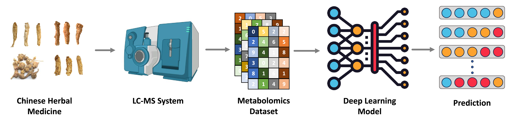

# HerbMet: A Framework for Chinese Herbal Medicine Identification via Deep Learning and Metabolomics Data

## Introduction

Chinese herbal medicine has been used for thousands of years to prevent and treat diseases. Several high-value Chinese herbal medicines are used in drugs and foods that have proven medical and health benefits. Identifying species might be challenging because several herbal medicines contain similar bioactive constituents. Therefore, accurate identification of Chinese herbal medicines is crucial due to varying medicinal effects. This study aims to develop a high-performance artificial intelligence system to identify Chinese herbal medicines, especially to identify those from different species of the same genus. We summarize the contributions of our paper as follows:

1. We developed HerbMet, an efficient Chinese herbal medicine identification system, with a simple 1D-ResNet architecture and metabolomics data. The proposed method can provide a strong baseline for metabolomics data analysis.

2. The DDR is a regularization method based on standard Dropout technology. It can solve the problem of overfitting in the Chinese herbal medicine dataset and optimize algorithm performance.

3. We conduct extensive experiments on two Chinese herbal medicine metabolomics datasets, and the results demonstrate that our proposed method has significant advantages in terms of accuracy, robustness, and model effectiveness


## Proposed Method

This article presents HerbMet, an AI-based system for accurately identifying Chinese herbal medicines. To achieve this goal, we design 1D-ResNet architecture to extract discriminated features from the input samples and then employ Multilayer Perceptron (MLP) to map these representations to the final results. To alleviate overfitting, we also introduce the Double Dropout Regularization Module (DDR) to optimize the model performance. In order to evaluate the model performance, we conduct extensive experiments on our collected dataset, including the *Panax ginseng* and *Gleditsia sinensis* datasets.




## Dataset
We utilize d two publicly available metabolomics datasets on the roots for of 7 Panax ginseng species and the seeds of 3 Gleditsia sinensis varieties to develop and evaluate our AI models. For detailed information on the protocols for metabolite extraction and analysis using LC-Q-TOF, please refer to the original cited publications. Detailed metabolite extraction and analysis protocols using LC-Q-TOF can be found in the original publications cited. The main objective for this study was to address the current limitations of metabolomics data analysis. We briefly described the metabolomic datasets as follows: tThe Panax ginseng dataset  comprisesntains a total of 70 samples, includingwith 7 species, and with 10 samples per species. Each sample involves with 253-dimensional featuress, which. This can be represented as a 70×253 matrix. The Gleditsia sinensis dataset contains 45 samples divided, split into 3 categories, with 15 samples eachfor each type. The feature dimension of the Gleditsia sinensis dataset is much higher than that of the Panax ginseng onedataset, withand each sample containings 2,867-dimensional features. We defined a matrix with 45×2,867 matrix to represent the collected Gleditsia sinensis dataset. The details of these collected datasets are shown presented in Table S1 and Table S2,, respectively and the raw metabolomics data are incan be found in Data S1 and Data S2. 

- Data-S1.csv: Processed metabolomics data for Panax ginseng used in this study.
- Data-S2.csv: Processed metabolomics data for Gleditsia sinensis used in this study.

## Environment

- The code is developed using python 3.10 on Ubuntu 20.04.
- The proposed method should be trained and validated in GPU.
- If you want to train the proposed segmentation method on custom dataset, Nvidia GPUs are needed. 
- This code is development and tested using one Nvidia GTX 4090 GPU.  


## Quick start

### Installation

1. Clone this repo:
   ```
   git clone git@github.com:syysha0k/HerbMet.git
   ```

2. Install dependencies:
   ```
   pip install -r requirements.txt
   ```


### Model training and validation 

1. Training the HerbMet:
    ```
    python herbmet_main.py
    ```

2. Feature selection with several methods:
    ```
    python feature_selection.py
    ```

* Please modify the file path according to the location of the dataset.
* The source codes are saved in the Codes File.


**Notable:** If you are interseted in our project or dataset, please contact with us. 
